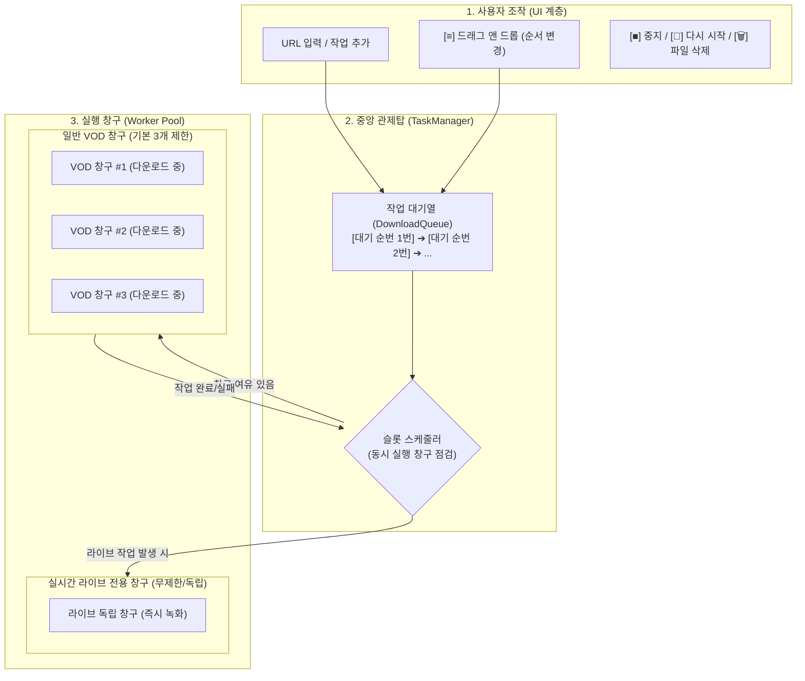
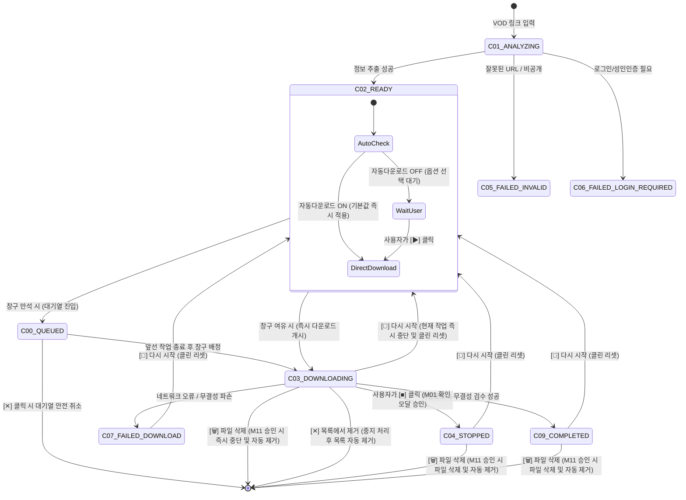
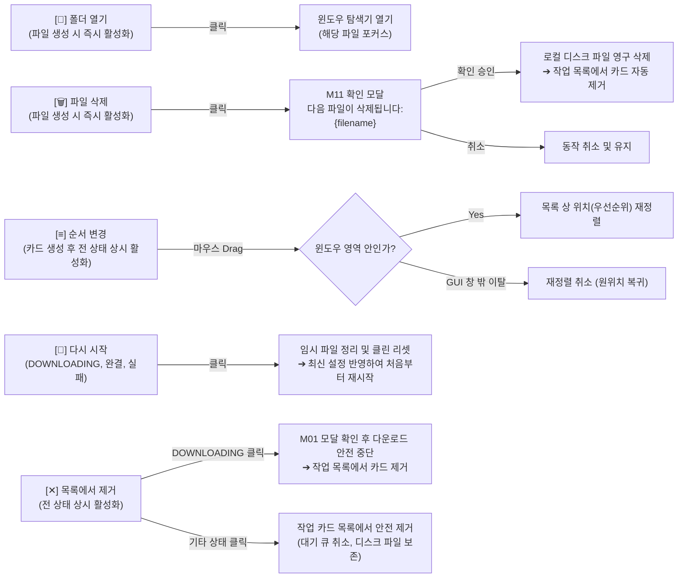

# [규격서] 중앙 작업 큐 관리자(TaskManager) 및 비동기 상태 머신 아키텍처

> **문서 상태**: 설계 완료 (RFC #87 승인 규격)  
> **관련 이슈**: [#87](https://github.com/Yumetri/chzzk_downloader/issues/87), [#86](https://github.com/Yumetri/chzzk_downloader/issues/86), [#95](https://github.com/Yumetri/chzzk_downloader/issues/95)  
> **관련 문서**: [`docs/UI_FEEDBACK_CATALOG.md`](UI_FEEDBACK_CATALOG.md), [`docs/CHZZK_VOD_PIPELINE_SPEC.md`](CHZZK_VOD_PIPELINE_SPEC.md)

---

## 1. 개요 및 목적

### 1.1 배경
기존 구조에서는 개별 작업 카드 UI 위젯(`TaskCardWidget`)이 다운로드 워커를 직접 생성하고 실행하는 형태로 동작했습니다. 이로 인해 여러 개의 VOD 링크를 한 번에 추가하면 모든 다운로드가 동시에 개시되어 다음과 같은 심각한 문제가 발생할 위험이 있었습니다:
1. **네트워크 대역폭 포화 및 네이버 CDN 차단**: 수십 개의 세그먼트 커넥션이 폭증하여 통신 속도가 급감하거나 네이버 CDN으로부터 `429 Too Many Requests` 일시 차단을 당함.
2. **UI 스레드 버벅임(UI Lag/Freeze)**: 여러 작업의 대용량 입출력 및 FFmpeg 병합 연산이 UI 스레드와 직접 맞물려 메인 창이 멈칫거리는 현상 발생.
3. **일관성 없는 상태 관리**: 작업 취소, 중지, 순서 변경 시 카드별로 상태가 따로 놀아 일관된 작업 큐 제어가 어려움.

### 1.2 핵심 설계 목적
Hitomi Downloader 등 신뢰성이 입증된 오픈소스 다운로더의 아키텍처를 벤치마킹하여, **UI와 완전하게 격리된 중앙 작업 관리 계층(`TaskManager`)**과 **엄격한 작업 상태 머신(Task State Machine)**을 구축합니다.

- 🏦 **동시 다운로드 창구(슬롯) 제어**: 일반 VOD 다운로드 창구 수를 제한(기본 3개)하여 CDN 부하를 완벽히 통제.
- 🚀 **실시간 라이브 녹화 독립 레인**: 실시간 라이브 방송은 VOD 창구와 분리된 '독립 창구'로 즉시 가동하여 방송 시작 부분 유실을 100% 방지.
- ⚡ **무중단 60fps GUI 반응성**: UI는 오직 시그널 수신 및 화면 렌더링만 담당하며, 모든 고부하 I/O 및 인코딩은 백그라운드 워커 풀에서 격리 처리.
- 🛡️ **결손/중복 프레임 방지 원칙**: 중지된 작업(`STOPPED`)의 무분별한 이어받기를 원천 차단하고 클린 리셋 체계를 확립.
- 🧹 **명확한 작업 정리 원칙**: 파일 삭제 시 작업 카드를 목록에 어중간하게 남겨두지 않고, 디스크 파일 삭제와 동시에 작업 목록에서 자동으로 안전 제거.

---

## 2. 중앙 작업 관리자(TaskManager) 아키텍처

### 2.1 쉬운 일상 비유: "은행 창구 및 대기 번호표 시스템"



1. **일반 VOD 다운로드 창구 (동시 다운로드 슬롯)**:
   - **기본값 3개 창구** 운영 (설정에서 1~5개, 고급 설정 시 최대 10개까지 조절 가능).
   - 창구가 모두 차 있으면 새로 등록된 VOD는 대기 번호표(`C00 QUEUED`)를 받고 순서대로 기다립니다.
   - 앞선 작업이 끝나서 창구가 비는 순간, 대기열 최우선 순위의 작업이 즉시 창구로 호출되어 다운로드를 시작합니다.
2. **실시간 라이브 녹화 VIP 독립 창구 (Live Lane Isolation)**:
   - 실시간 라이브 녹화는 방송이 켜진 바로 그 순간부터 세그먼트를 받아야 앞부분이 잘리지 않습니다.
   - 따라서 라이브 녹화는 VOD 다운로드 3개 창구가 꽉 차 있더라도 **이에 구애받지 않는 독립 전용 창구에서 즉시 가동**됩니다.

### 2.2 핵심 컴포넌트 구성

| 컴포넌트 | 담당 모듈 | 주요 역할 및 책임 |
| :--- | :--- | :--- |
| **`TaskManager`** | `core/task_manager.py` | 전체 작업 라이프사이클을 통괄하는 컨트롤 타워. 작업 추가/제거/재정렬 및 스케줄러 구동. |
| **`TaskQueue`** | `core/task_queue.py` | 스레드 안전(Thread-safe)한 우선순위 작업 대기열. 사용자의 드래그 앤 드롭 순서 변경 반영. |
| **`WorkerPool`** | `core/worker_pool.py` | `QThreadPool` / `QRunnable` 기반의 백그라운드 워커 관리 풀. CPU 및 네트워크 I/O 비동기 실행. |
| **`VODPipelineWorker`** | `core/vod_worker.py` | `yt-dlp` 청크 수신 ➔ FFmpeg Muxing ➔ FFprobe 0.5초 무결성 검수 파이프라인 수행. |
| **`LiveRecordingWorker`** | `core/live_worker.py` | Streamlink 기반 fMP4 무손실 직접 저장 및 타임머신(DVR) 제어 전담. |

---

## 3. 작업 생명주기 및 상태 머신 (Task State Machine)

### 3.1 상태 전수 카탈로그 (C00 ~ C07, C09)

작업 카드는 생성부터 소멸까지 다음 상태 중 정확히 하나의 상태를 유지합니다.  
*(※ 파일 삭제 시에는 별도의 잔여 상태 카드를 남기지 않고 디스크 파일 삭제와 동시에 작업 목록에서 자동으로 즉시 제거됩니다.)*

| ID | 상태 코드 (`TaskStatus`) | 설명 및 비유 | 3번 위치 (진행 표시) | 4번 위치 (하단 컨트롤) | 2번 위치 (상단 액션 활성화) |
| :--- | :--- | :--- | :--- | :--- | :--- |
| **C00** | `QUEUED` | **대기 중** (번호표를 받고 대기열에서 차례를 기다리는 상태) | `대기 중 (대기 순번: N번)` | *(숨김)* | `[≡]` 순서변경, `[✕]` 큐 취소 |
| **C01** | `ANALYZING` | **URL 분석 중** (서버에 접속하여 영상 정보/스트리머 조회) | `분석 중...` | 회전 스피너 | `[≡]` 순서변경, `[✕]` 목록 제거 |
| **C02** | `READY` | **분석 완료 대기** (다운로드 옵션 확인 및 시작 대기) | `{화질} \| {재생시간}` | 화질/확장자/폴더/`[▶]` | `[≡]` 순서변경, `[✕]` 목록 제거 |
| **C03** | `DOWNLOADING` | **다운로드 실행 중** (청크 수신 ➔ Muxing ➔ 검수 파이프라인) | 진행률 바 (`{속도} \| {ETA}`) | `[■]` 중지 버튼 (M01 연계) | **`[📁]` 폴더, `[🗑️]` 삭제, `[≡]` 순서변경, `[🔄]` 다시시작, `[✕]` 중지 후 제거** |
| **C04** | `STOPPED` | **중지됨 (완결)** (사용자가 명시적으로 다운로드를 중단함) | `중지됨 ({진행률}%)` | *(숨김 - 재개 불가 완결)* | **`[📁]` 폴더, `[🗑️]` 삭제, `[≡]` 순서변경, `[🔄]` 다시시작, `[✕]` 목록제거** |
| **C05** | `FAILED_INVALID` | **링크 오류** (삭제되었거나 존재하지 않는 치지직 링크) | *(숨김)* | `[Z]` 치지직, `[🗨️!]` 작업정보 | **`[≡]` 순서변경, `[🔄]` 다시시작, `[✕]` 목록 제거** |
| **C06** | `FAILED_LOGIN_REQUIRED`| **인증 필요** (성인인증 또는 유료 구독자 전용 영상) | *(숨김)* | `[Z]`, `[🗨️!]`, `[🍪]`, `[N]` | **`[≡]` 순서변경, `[🔄]` 다시시작, `[✕]` 목록 제거** |
| **C07** | `FAILED_DOWNLOAD` | **다운로드 실패** (네트워크 단절 또는 FFprobe 무결성 검수 실패) | *(숨김)* | `[Z]` 치지직, `[🗨️!]` 작업정보 | **`[≡]` 순서변경, `[🔄]` 다시시작, `[✕]` 목록 제거** |
| **C09** | `COMPLETED` | **완료** (다운로드, 병합, 0.5초 무결성 검수가 모두 끝남) | `완료 ({재생시간} \| {용량})` | *(숨김)* | **`[📁]` 폴더, `[🗑️]` 삭제, `[≡]` 순서변경, `[🔄]` 다시시작, `[✕]` 목록제거** |

### 3.2 상태 전이 다이어그램 (State Diagram)



### 3.3 핵심 상태 전이 규칙 및 안전장치

#### 1) `C02: READY`의 자동/수동 다운로드 분기
- **VOD 자동 다운로드 활성화 (`vod_auto_download == True`)**:
  - `ANALYZING`이 끝나자마자 환경설정의 기본 화질 및 기본 확장자를 즉시 적용합니다.
  - 사용자가 별도로 `[▶]`를 누를 필요 없이 즉시 `QUEUED` 또는 `DOWNLOADING` 상태로 자동 전이합니다.
- **VOD 자동 다운로드 비활성화 (`vod_auto_download == False`)**:
  - 4번 위치에 화질 콤보, 확장자 콤보, 저장 폴더 버튼(`📁`), 다운로드 시작 버튼(`[▶]`)을 표시하고 대기합니다.
  - 사용자가 원하는 화질/확장자를 고른 뒤 `[▶]` 버튼을 클릭해야만 `QUEUED` 또는 `DOWNLOADING`으로 전이합니다.

#### 2) `C04: STOPPED` 중단 후 이어받기 금지 (완결 상태 보장)
- 다운로드 중 사용자가 `■` 버튼을 클릭하면 **M01 모달(`정말 중지하시겠습니까?`)**을 띄우고, 승인 시 다운로드를 안전하게 멈추고 `STOPPED`로 전이합니다.
- **이어받기 불가 원칙**:
  - HLS/DASH 조각 스트림 특성상 중간에 멈췄다가 이어받으면 패킷 손실, 타임스탬프 왜곡, 오디오 싱크 밀림이 발생합니다.
  - 따라서 `STOPPED` 상태에서는 **4번 위치의 컨트롤을 일체 숨기며(`hide()`), 이어받기(`STOPPED -> DOWNLOADING`)는 기술적으로 불허**합니다.
  - 다시 다운로드하려면 2번 위치의 `[🔄 다시 시작]`을 눌러 임시 파일을 깨끗이 지우고 처음부터 완전한 파일로 다시 받아야 합니다.

#### 3) 파일 삭제 시 작업 목록 자동 제거 원칙
- 디스크 파일 삭제(`[🗑️]`) 승인 시에는 카드를 다른 불완전 상태로 화면에 방치하지 않고, **파일 영구 삭제 완료와 동시에 작업 카드를 목록에서 자동으로 즉시 제거**하여 사용자의 의도(작업 완전 정리)를 깔끔하게 완결합니다.

---

## 4. 작업 카드 2번 위치(우상단) 5대 액션 툴바 상세 인터랙션

작업 카드의 우측 상단(2번 위치)에는 완료/중지/다운로드 중인 작업을 통제할 수 있는 **5대 핵심 액션 아이콘 툴바**가 제공됩니다.

```
+-------------------------------------------------------------------+
| [썸네일]  1번 위치: [스트리머] 방송 제목       2번 위치: [📁][🗑️][≡][🔄][✕] |
|                                                                   |
|          3번 위치: 진행률 바 / 상태 텍스트       4번 위치: [하단 컨트롤 툴바] |
+-------------------------------------------------------------------+
```

### 4.1 5대 액션 아이콘 규격 및 동작 명세



1. **`[📁]` 폴더 열기 (Show in Folder)**:
   - **활성화 시점**: **파일이 일단 디스크에 생성되면 즉시 활성화 (`DOWNLOADING`, `STOPPED`, `COMPLETED`)**.
     - 다운로드가 시작되어 임시 파일 또는 대상 파일이 로컬 디스크에 쓰이기 시작한 순간부터 다운로드 진행 중(`DOWNLOADING`)이라도 언제든지 클릭할 수 있습니다.
   - **동작**: 윈도우 파일 탐색기를 열고 해당 다운로드 파일에 자동으로 파란색 포커스를 맞춥니다.
2. **`[🗑️]` 파일 삭제 (Delete File - 빨간색 하이라이트)**:
   - **활성화 시점**: **파일이 일단 디스크에 생성되면 즉시 활성화 (`DOWNLOADING`, `STOPPED`, `COMPLETED`)**.
   - **시각 피드백**: 위험 작업임을 직관적으로 알 수 있도록 마우스 호버 시 **빨간색 아이콘 및 레드 틴트 배경(`rgba(239, 68, 68, 0.2)`)**으로 하이라이트됩니다.
   - **확인 모달 연계 (M11 모달)**:
     - 문구: `다음 파일이 삭제됩니다:\n{filename}`
     - 버튼: 위험 강조 빨간색 `[확인]` (기본 포커스) / `[취소]`
     - 확인 클릭 시:
       - **다운로드 중(`DOWNLOADING`)**: 백그라운드 다운로드 파이프라인을 즉시 안전하게 강제 중단(Cancel/Kill)하고, 디스크에 쓰이던 파일 및 임시 파일을 영구 삭제한 뒤 **작업 카드를 작업 목록에서 자동으로 제거**합니다.
       - **완결 상태(`STOPPED`, `COMPLETED`)**: 디스크 파일 영구 삭제 완료와 동시에 **작업 카드를 작업 목록에서 자동으로 제거**합니다.
3. **`[≡]` 순서 변경 (Drag & Drop Reorder)**:
   - **활성화 시점**: **작업 카드가 생성되면 모든 상황/상태에서 상시 활성화 (`ANALYZING`, `READY`, `QUEUED`, `DOWNLOADING`, `STOPPED`, `FAILED_...`, `COMPLETED` 전 상태)**.
   - **동작**: 아이콘을 마우스로 클릭한 채 위아래로 끌어서 작업 목록 상의 위치(우선순위)를 자유롭게 변경합니다. 대기 중인 작업(`QUEUED`)의 경우 창구 진입 우선순위가 함께 변경됩니다.
   - **화면 이탈 안전장치**: **마우스 커서가 메인 GUI 윈도우 영역 밖으로 벗어난 상태의 움직임은 목록에 절대 반영하지 않고 즉시 취소**하여 원래 위치로 안전하게 복원합니다.
4. **`[🔄]` 다시 시작 (Clean Reset)**:
   - **활성화 시점**: **`DOWNLOADING`, `STOPPED`, `COMPLETED`, `FAILED_...` 상태에서 활성화**.
   - **동작**:
     - **다운로드 중(`DOWNLOADING`)**: 현재 진행 중인 다운로드를 즉시 안전하게 중단하고 임시 파일을 정리(Clean Reset)한 뒤, 최신 환경설정을 반영하여 처음부터 다시 다운로드를 시작합니다.
     - **완결/실패 상태**: 이전 진행 정보 및 오류 기록을 완전히 초기화하고, 최신 환경설정(기본 화질/확장자/폴더)을 새롭게 반영하여 작업을 처음부터 다시 시작합니다.
5. **`[✕]` 목록에서 제거 (Remove Card)**:
   - **활성화 시점**: **모든 상황/상태에서 상시 활성화 (`DOWNLOADING` 포함 전 상태)**.
   - **동작**:
     - **일반/완결/실패 상태**: 작업 카드를 메인 화면의 작업 목록에서 완전히 제거합니다. 이미 완료/중지되어 로컬 디스크에 저장된 파일은 삭제되지 않고 안전하게 보존됩니다.
     - **대기 중(`QUEUED`)**: 큐에서 안전하게 취소하고 카드를 목록에서 제거합니다.
     - **다운로드 실행 중(`DOWNLOADING`)**: 클릭 시 **중지 버튼(`■`)과 동일한 동작을 수행(M01 중지 확인 모달 승인 시 다운로드 안전 중단)한 후, 작업 카드를 작업 목록에서 완전히 제거**합니다.

---

## 5. UI-코어 간 비동기 통신 계약 (Qt Signal & Slot)

UI 계층(`MainWindow`, `TaskCardWidget`)과 백그라운드 코어(`TaskManager`)는 엄격히 분리되며, 모든 통신은 Qt의 이벤트 루프 기반 시그널/슬롯으로만 교환됩니다.

### 5.1 데이터 구조체 명세

```python
from dataclasses import dataclass
from enum import Enum
from typing import Optional


class TaskStatus(Enum):
    QUEUED = "QUEUED"
    ANALYZING = "ANALYZING"
    READY = "READY"
    DOWNLOADING = "DOWNLOADING"
    STOPPED = "STOPPED"
    FAILED_INVALID = "FAILED_INVALID"
    FAILED_LOGIN_REQUIRED = "FAILED_LOGIN_REQUIRED"
    FAILED_DOWNLOAD = "FAILED_DOWNLOAD"
    COMPLETED = "COMPLETED"


@dataclass
class TaskProgress:
    """실시간 다운로드 진행 정보."""

    task_id: str
    downloaded_bytes: int
    total_bytes: int
    percentage: float  # 0.0 ~ 100.0
    speed_bytes_sec: float  # 초당 바이트 수
    speed_str: str  # 예: "15.4 MB/s"
    eta_seconds: int  # 남은 시간(초)
    eta_str: str  # 예: "00:03:25"


@dataclass
class TaskSpec:
    """작업 생성 및 실행 명세."""

    task_id: str
    video_url: str
    is_live: bool
    title: str
    streamer: str
    selected_quality: str
    selected_ext: str
    save_path: str
```

### 5.2 시그널 통신 규약 (`TaskManagerSignals`)

```python
from PyQt6.QtCore import QObject, pyqtSignal


class TaskManagerSignals(QObject):
    # 1. 작업 생명주기 및 상태 변화 시그널
    task_added = pyqtSignal(str, object)  # (task_id, TaskSpec)
    task_status_changed = pyqtSignal(
        str, object, object
    )  # (task_id, old_status, new_status)
    task_completed = pyqtSignal(str, str)  # (task_id, final_file_path)
    task_failed = pyqtSignal(str, str, str, str)  # (task_id, err_type, msg, traceback)
    task_removed = pyqtSignal(str)  # (task_id) - 파일 삭제 또는 목록 제거 시 방출

    # 2. 고주파 프로그레스 시그널 (UI 렌더링 부하 방지를 위해 100ms 스로틀링 적용)
    task_progress_updated = pyqtSignal(str, object)  # (task_id, TaskProgress)

    # 3. 큐 및 스케줄러 상태 시그널
    task_reordered = pyqtSignal(str, int, int)  # (task_id, old_index, new_index)
    queue_updated = pyqtSignal(int, int, int)  # (running_vod, queued_vod, running_live)
```

---

## 6. 예외 처리, 동시성 안전장치 및 데이터 무결성 보장

### 6.1 UI 무중단 60fps 보장 (이벤트 루프 스로틀링)
- `yt-dlp`의 진행률 훅(`progress_hooks`)은 초당 수십~수백 번 호출될 수 있습니다.
- 백그라운드 워커는 이를 가공할 때 **최소 100ms(0.1초) 주기로 스로틀링(Throttling)**하여 시그널을 방출합니다.
- 이를 통해 수많은 작업 카드가 동시에 다운로드되더라도 UI 스레드가 이벤트 처리 폭주로 멈칫거리는 현상을 원천 방지합니다.

### 6.2 임시 파일 격리 및 비정상 종료 대응
- 다운로드 중에는 임시 확장자(`.part`, `.ytdl`)로 디스크에 쓰며, 정상 검증 완료 시점에만 최종 파일명(`.mp4`)으로 원자적 이름 변경(Atomic Rename)을 수행합니다.
- 사용자가 `■`를 눌러 `STOPPED` 완결 처리하거나 `[🗑️]` 파일 삭제 시, 쓰다 만 손상된 조각 파일은 안전하게 정리됩니다.

### 6.3 중복 요청 및 동시성 충돌 방지 (Race Condition 방지)
- 동일한 VOD URL이 이미 작업 큐에 등록되어 있는 경우, 메인 창 입력 단계에서 **`T03` 토스트 경고** 또는 **`M02` 확인 모달**로 사용자에게 안내하여 중복 큐 진입을 방지합니다.
- 창구 할당 시 스레드 락(Mutex)을 사용하여 동일 슬롯에 복수의 작업이 동시에 진입하는 Race Condition을 원천 차단합니다.

---

## 7. 향후 구현 티켓 및 연계 마일스톤

본 RFC #87 설계를 바탕으로 다음과 같이 명확히 분리된 구현 티켓을 순차적으로 발행하여 TDD 방식으로 안전하게 개발을 진행합니다.

1. **티켓 1: `TaskManager` 코어 스케줄러 및 우선순위 큐 구현**:
   - `core/task_manager.py` 및 `core/task_queue.py` 구현.
   - VOD 슬롯(기본 3개) 제어 및 라이브 독립 레인 분리 스케줄링 유닛 테스트.
2. **티켓 2: 작업 카드 2번 위치 5대 액션 툴바 및 인터랙션 구현**:
   - `TaskCardWidget` 2번 위치에 5대 액션 버튼(`📁`, `🗑️`, `≡`, `🔄`, `✕`) 렌더링.
   - `[📁] 폴더 열기`: 파일 생성 시점부터 활성화 (`DOWNLOADING`, `STOPPED`, `COMPLETED`).
   - `[🗑️] 파일 삭제`: 파일 생성 시점부터 활성화 (`DOWNLOADING`, `STOPPED`, `COMPLETED`), M11 모달 연동 및 디스크 파일 삭제와 동시에 **작업 목록에서 카드 자동 제거**.
   - `[≡] 순서 변경`: 작업 카드 생성 후 모든 상황에서 상시 활성화되는 마우스 드래그 앤 드롭 구현 및 **마우스 커서 메인 GUI 창 이탈 시 자동 취소(원위치 복원) 안전장치** 구현.
   - `[🔄] 다시 시작`: `DOWNLOADING`, `STOPPED`, `COMPLETED`, `FAILED_...` 활성화 및 클린 리셋 재시작.
   - `[✕] 목록에서 제거`: 모든 상황에서 활성화되며, `DOWNLOADING` 중 클릭 시 중지 버튼과 동일하게 M01 확인 후 안전 중단 및 작업 카드 목록 제거 구현.
3. **티켓 3: 작업 카드 상태 머신(C00, C01~C07, C09) 및 4분면 레이아웃 상태 전이 구현**:
   - 작업 카드 4분면 레이아웃의 C00~C07, C09 상태별 가시성 제어.
   - `C00: QUEUED` 대기 상태 UI 처리 (대기 순번 표시).
   - `C02: READY` 자동/수동 다운로드 분기 처리.
   - `C04: STOPPED` 재개 불가 완결 상태 보장 (4번 위치 컨트롤 숨김).
   - `C09: COMPLETED` 완료 상태 표시.
4. **티켓 4: VOD/라이브 파이프라인과 TaskManager 시그널 연동**:
   - `#86` VOD 파이프라인 및 `#95` 라이브 엔진을 `TaskManager`의 워커 풀에 결합하고 무중단 다운로드/녹화 연동 검증.
