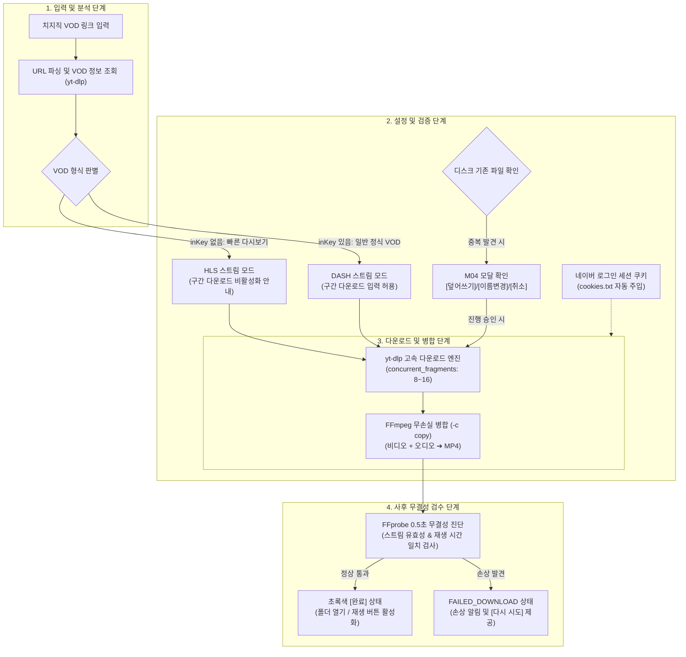

# 치지직 VOD 다운로드 파이프라인 및 미디어 무결성 검증 규격서
> **관련 이슈**: `#86 [RFC/설계 논의] VOD 및 라이브 다운로드 파이프라인 아키텍처 수립 (yt-dlp + FFmpeg 연계 및 Muxing)`  
> **참조 문서**: `docs/DOWNLOADER_GUI_ARCHITECTURE.md`, `docs/CHZZK_LIVE_RECORDING_ENGINE_SPEC.md`, `docs/UI_FEEDBACK_CATALOG.md`

---

## 1. 개요 및 파이프라인 아키텍처

본 문서는 치지직(CHZZK) VOD(다시보기) 영상 다운로드, 고화질 분리 스트림(영상/음성)의 무손실 병합(Muxing), VOD 형식별 구간 다운로드 제어, 그리고 다운로드 직후의 미디어 파일 무결성 진단 파이프라인 규격을 정의합니다.

### 1.1 벤치마크 분석 및 엔진 설계 방향
치지직 고화질 VOD는 영상(Video) 트랙과 음성(Audio) 트랙이 분리되어 제공되므로, 안정적인 청크 수신과 무손실 병합이 필수적입니다. 본 프로젝트는 기존 도구들의 벤치마크 분석을 토대로 **"Hitomi의 안정성"**과 **"recordWEB의 다운로드 속도"**를 결합한 하이브리드 파이프라인을 채택했습니다.

| 비교 항목 | Hitomi Downloader 모델 | recordWEB v1.2.9 모델 | **치지직 다운로더 확정 사양 (#86)** |
| :--- | :--- | :--- | :--- |
| **다운로드 주 엔진** | `yt-dlp` 단일 엔진 | 이원화 분기 (HLS: Streamlink / DASH: aria2c 16분할) | **`yt-dlp` 기반 + 고속 청크 수신 최적화** |
| **속도 가속화** | 기본 단일 다운로드 | `aria2c` 16분할 멀티스레드 | **`yt-dlp` 내장 `concurrent_fragments` (8~16) 가속** |
| **안정성 / 유지보수** | 🛡️ 오픈소스 자동 대응 (높음) | ⚠️ 네이버 비공식 API 의존 (취약) | 🛡️ **`yt-dlp` 검증 엔진으로 높은 안정성 유지** |
| **구간 다운로드** | 지원 (CLI 인자) | 정식 VOD(DASH)만 지원 (HLS 불허) | **정식 VOD(DASH) 지원 / 빠른 다시보기(HLS) 안전 비활성화** |
| **사후 무결성 검수** | 미지원 | 단순 파일 크기 검사 | **`FFprobe` 기반 0.5초 무결성 자동 진단 연계** |

---

## 2. 치지직 VOD 형식별 처리 및 구간 다운로드 전략

### 2.1 VOD 형식에 따른 근본적 차이
1. **빠른 다시보기 (HLS, `inKey is None`)**:
   - 방송 종료 직후 네이버 CDN에 임시로 업로드된 세그먼트(조각) 플레이리스트입니다.
   - 전체 미디어 타임코드와 키프레임 인덱스가 정식 정렬되지 않은 상태입니다.
2. **일반 정식 VOD (DASH, `inKey is not None`)**:
   - 네이버 인코딩 서버가 변환 및 패키징을 완료한 영구 보존용 VOD입니다.
   - 명확한 타임스탬프와 샘플 메타데이터가 완비되어 있습니다.

### 2.2 구간 다운로드(Section Download) 정책
- **일반 정식 VOD (DASH)**:
  - 구간 다운로드(`HH:MM:SS ~ HH:MM:SS`)를 **100% 정상 지원**합니다.
  - `yt-dlp`의 `--download-sections "*start-end"` 파라미터 또는 FFmpeg 시간 옵션을 통해 원하는 구간만 무손실로 빠르게 추출합니다.
- **빠른 다시보기 (HLS)**:
  - 타임스탬프 불완전성으로 인해 구간 자르기 시 영상 끊김, 오디오 싱크 밀림이 발생할 수 있습니다.
  - 작업 카드 UI에서 **구간 입력창을 비활성화(disabled)** 처리하고, *"빠른 다시보기(임시 스트림)는 전체 다운로드만 지원합니다"* 툴팁을 제공하여 사용자 혼란을 방지합니다.

---

## 3. 사후 미디어 무결성(불량 파일) 자동 검수 체계

다운로드가 100% 완료된 후, 사용자에게 최종 완료 도장을 찍어주기 전 **0.5초 이내의 신속한 무결성 진단**을 수행합니다.

### 3.1 검증 도구 및 방식
- **도구**: `FFprobe` (`verify_media_file_integrity`)
- **실행**: `ffprobe -v error -show_entries format=duration:stream=codec_type,duration -of json [출력파일]`
- **검증 항목**:
  1. **스트림 구성 유효성**: 비디오 트랙과 오디오 트랙이 모두 정상 존재하는지 (`nb_streams >= 2`).
  2. **재생 시간 일치성**: 실제 미디어 스트림 Duration이 메타데이터 상의 영상 Duration과 정상 범위 내로 일치하는지 (파일 끝부분 잘림 방지).
  3. **컨테이너 헤더 정상성**: moov atom 파손 없이 정상 재생 가능한 파일인지 검증.

### 3.2 진단 결과 처리 흐름
- **검증 통과 시**: 작업 상태를 `COMPLETED`로 전이하고 다운로드 완료 효과음 및 폴더 열기 활성화.
- **검증 실패 시**:
  - 작업 상태를 `FAILED_DOWNLOAD`로 전이 (작업 카드 좌측 오렌지 바 강조).
  - 상태 메시지에 *"다운로드된 파일이 손상되었습니다"* 표시 및 원클릭 `[다시 시도]` 버튼 제공.

---

## 4. 인증 및 보안 헤더 자동 주입

### 4.1 네이버 세션 쿠키 연동
- 사용자가 설정한 네이버 로그인 세션 쿠키(`~/.chzzk_downloader/cookies.txt`)를 `yt-dlp`의 `cookiefile` 옵션에 자동으로 주입합니다.
- 이를 통해 19세 이상 성인 인증 VOD 및 채널 구독자 전용 VOD를 사용자의 추가 조작 없이 매끄럽게 다운로드합니다.

### 4.2 CDN 차단 방어 헤더
- 네이버 CDN의 비인가 접근 차단(HTTP 403 Forbidden / 400 Bad Request)을 방어하기 위해 다음 헤더를 기본 주입합니다:
  - `User-Agent`: 표준 데스크톱 브라우저 UA (`config.DEFAULT_USER_AGENT`)
  - `Referer`: `https://chzzk.naver.com/`

---

## 5. 작업 표시명, 파일명 생성 및 중복 충돌 처리 정책

### 5.1 작업 카드(UI 1번 위치) 작업 표시명 규칙
`yt-dlp` 비동기 분석 성공 시 작업 카드가 준비 완료 상태(`READY`)로 갱신되며, 카드의 1번 위치(좌상단 작업 타이틀)에 기존 규약에 따른 표시명 규칙이 적용됩니다:
- **라이브 시작일(`liveOpenDate`) 확인 시**: `[{streamer}] {%Y-%m-%d} {title}`
  - 예: `[마레 플로스] 2026-09-08 방송 제목`
- **일반 VOD / 시작일 미확인 시**: `[{streamer}] {title}`
  - 예: `[마레 플로스] 방송 제목`

### 5.2 디스크 저장 파일명 생성 규칙 (`core/filename_generator.py`)
실제 로컬 파일시스템에 저장되는 표준 파일명은 다음 템플릿과 정제 규칙을 따릅니다:
- **라이브일시 확인 시**: `[{streamer}] date:{liveOpenDate}; {title} ({videoNo}){ext}`
  - Windows 금지 문자인 콜론(`:`)은 전각 콜론(`：`)으로 자동 치환됩니다.
  - 예: `[마레 플로스] date：2026-09-08 18：30； 방송 제목 (12345).mp4`
- **일반 VOD / 미확인 시**: `[{streamer}] {title} ({videoNo}){ext}`
  - 예: `[마레 플로스] 방송 제목 (12345).mp4`
- **파일명 금지 문자 정제**:
  - `\ / * ? " < > |` 및 개행문자는 언더바(`_`)로 치환되며, 연속 공백 정리 및 앞뒤 마침표/공백이 안전하게 제거됩니다.

### 5.3 중복 파일 충돌 방지 정책
1. **작업 큐(목록) 내 중복**:
   - 이미 작업 목록에 존재하는 VOD 링크 입력 시:
     - 다운로드 진행 중인 경우: `T03` 경고 토스트 (`⚠️ 이미 추가한 작업입니다.`)
     - 완료/중지된 작업인 경우: `M02` 확인 모달 (`이미 추가한 작업입니다. 다시 다운로드하시겠습니까?`)
2. **저장 폴더(디스크) 상의 파일 중복**:
   - 작업 목록에는 없으나, 지정된 저장 경로에 동일한 파일명의 파일이 이미 존재하는 경우:
   - 다운로드 프로세스 시작 직전 **`M04` 확인 모달** 호출:
     - 문구: `이미 동일한 이름의 파일이 존재합니다:\n{filename}`
     - 버튼: `[덮어쓰기]` / `[이름 변경(기본)]` / `[취소]`
     - `이름 변경` 선택 시 파일명 뒤에 `(1)`, `(2)`를 순차 부여하여 기존 파일을 안전하게 보존합니다.
